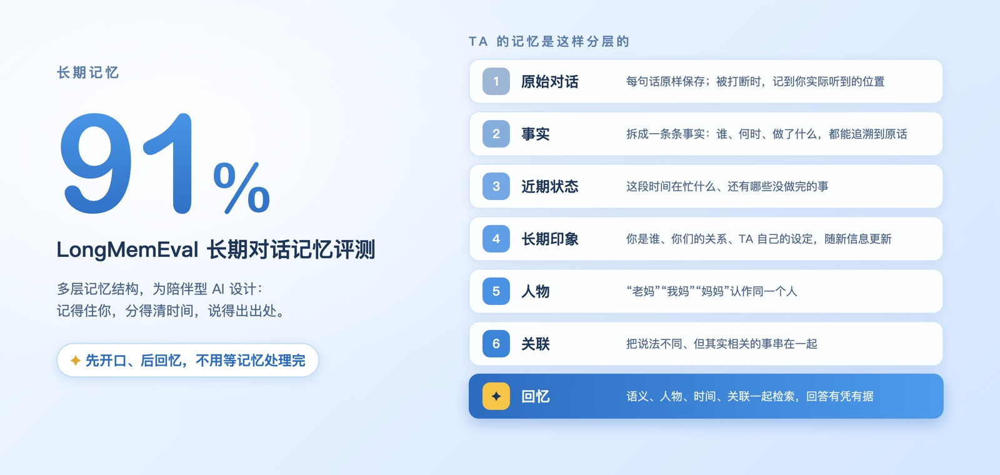
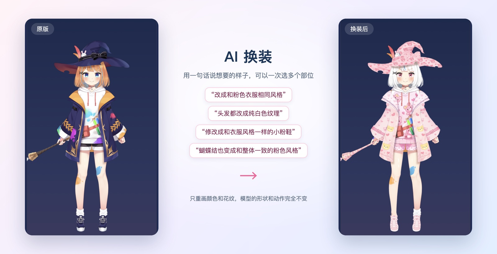
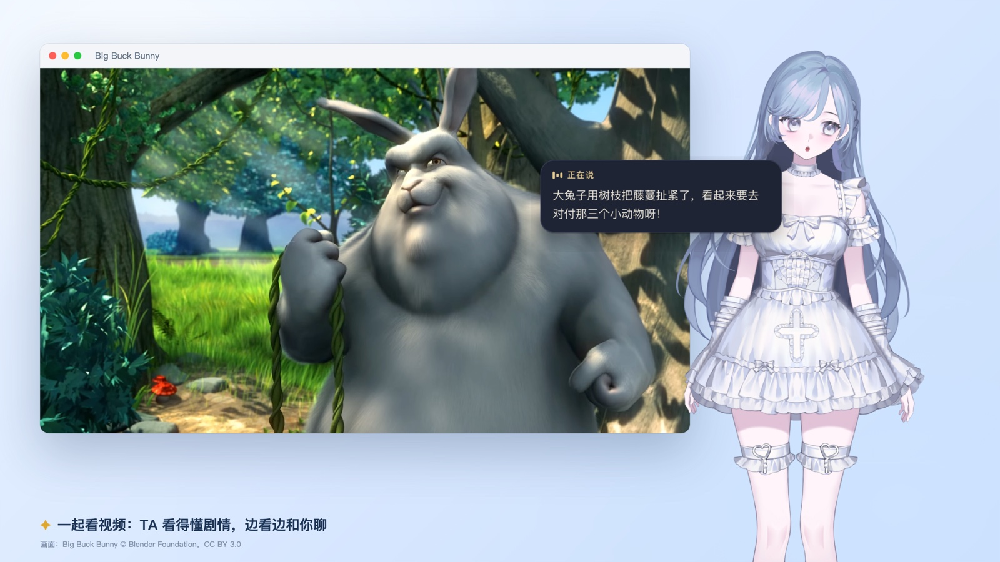
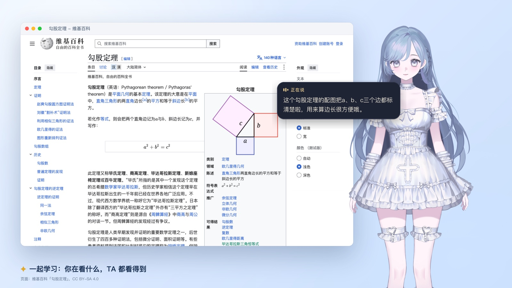
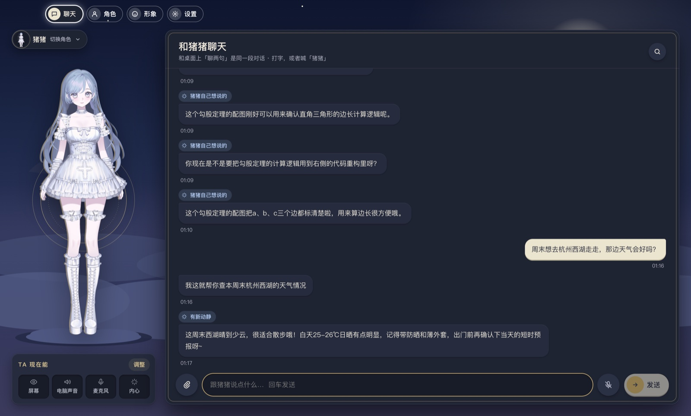

<h3>住在你桌面上的 AI 伙伴：记得你、看得懂你在做什么、随时陪你聊</h3>

  
  
  
  

  <a href="#记得你longmemeval-91">长期记忆</a> ·
  <a href="#任意-live2d-模型实时表情">任意 Live2D 模型</a> ·
  <a href="#实时陪伴">实时陪伴</a> ·
  <a href="#快速开始">快速开始</a>

 

## 记得你：LongMemEval 91%

tulpa 内置一套专为陪伴型 AI 设计的**多层记忆系统**，在长期对话记忆评测 **LongMemEval 上达到 91%**。

- **分层记忆**：原始对话、事实、近期状态、长期印象、人物、关联层层整理。TA 不只记得你说过的话，还知道你最近在忙什么、你们是什么关系。
- **有凭有据**：每条记忆都能追溯到当时的原话，不会把猜测当成事实。
- **先开口、后回忆**：TA 不用等记忆处理完才回答；需要想起往事时，会自然地接着说下去。
- **你说了算**：TA 记住了什么随时可以看；不想让 TA 记住的，让 TA 忘掉就行。

## 任意 Live2D 模型，实时表情

**导入你喜欢的任何 Live2D 模型，TA 说话时就会有真实的表情。** 每说一句话，决策模型都会根据内容判断眉眼、嘴型、头和身体怎么动；口型跟着声音实时变化。模型自带 VTube Studio 设置的，直接沿用作者的参数对应。

<table>
<tr>
<td width="40%" align="center"> 同一段话里，开心、生气、不屑、惊讶，表情随内容变化</td>
<td width="60%" align="center"> 每个部位动多少都能调，还能添加自己的部位</td>
</tr>
</table>

### AI 换装

用一句话说出想要的样子，一次选多个部位一起改。AI 只重画颜色和花纹，模型的形状和动作完全不变，换完立刻就能用。

## 实时陪伴

**由 Jev 决策模型驱动。** TA 能看到你的屏幕、听到电脑里正在播放的声音，有自己的内心想法；Jev 持续判断此刻该不该开口、说什么，所以 TA 不是在等你提问，而是真的在陪着你。

以上两张为合成画面：TA 说的话取自真实运行时的原话，桌面背景和窗口为后期排版。

### 聊着天，事情就办了

你只是问一句「西湖天气会好吗」，TA 自己就去查了，查完接着和你聊。上网搜索、控制家里的设备、把一件事交给 Agent 去办，都融在平常的对话里：**不用切换功能，也不用下指令。**

## 还能做什么

- **语音对话**：叫 TA 的名字就能开口，说到一半可以直接打断；可以设置成只听你的声音。
- **声音任选**：云端语音，或完全在本机运行的语音。
- **一个角色，多套形象**：名字、性格、和你的关系、声音和记忆属于角色；形象随时可换，每套形象的设置单独保存。
- **连接你的工具**：Home Assistant 智能家居、Agent（Hermes）、网络搜索；Codex 任务完成时让 TA 告诉你。

## 快速开始

1. 到 [Releases](https://github.com/ymybxx/tulpa/releases) 下载对应系统的安装包并安装。
   - **macOS**：首次打开如提示「无法验证开发者」，到「系统设置 › 隐私与安全性」里点「仍要打开」。
   - **Windows**：如果出现「Windows 已保护你的电脑」，点「更多信息 › 仍要运行」。
2. 跟着引导花几分钟完成设置：选形象、给 TA 起名字定性格、填一个对话模型（任何兼容 OpenAI 接口的服务，如豆包、通义千问），再选一个声音。
3. 接上决策模型（Jev 或阿里云百炼），解锁实时表情和更准的主动陪伴。

> **关于费用**：tulpa 本身免费，用到的 AI 服务按你自己的账号计费。开启实时陪伴后 TA 会持续感知和思考，token 消耗会明显多于普通聊天，可以随时在设置里关掉。

| 系统 | 要求 |
| --- | --- |
| macOS | 12.3 或更高，Apple 芯片（M 系列） |
| Windows | Windows 11，64 位 |

## 隐私

- 记忆、聊天记录和所有设置都保存在**你自己的电脑上**。
- AI 服务的密钥只存在本机，直接发给对应服务，不经过我们的服务器。
- 屏幕、电脑声音、麦克风都可以单独开关；只有需要时，相关内容才会发给你配置的 AI 服务。

## 常见问题

<b>可以用我自己的 Live2D 模型吗？</b>

 
可以，导入 Live2D Cubism 模型即可。请确认你拥有该模型的使用授权。

<b>支持 Intel 芯片的 Mac 吗？</b>

 
目前只提供 Apple 芯片版本。

<b>为什么系统提示「无法验证开发者」？</b>

 
Beta 版本还没有做苹果公证和 Windows 代码签名，按「快速开始」里的步骤放行即可。

## 反馈

遇到问题或有想法，欢迎到 [Issues](https://github.com/ymybxx/tulpa/issues) 告诉我们。

## 致谢

- [Live2D Cubism SDK](https://www.live2d.com/)：模型显示与动画；演示中的 Hiyori、Haru、Ren、Miara、Mao 为 Live2D 官方示例模型
- 模型「空」由 B 站 UP 主「逐尾鲨」创作
<!-- 发布前：取得「逐尾鲨」的公开展示授权后，再写「经授权展示」并附上作者主页链接 -->
- [VTube Studio](https://denchisoft.com/)：参考了它的面部参数约定
- 演示画面：《Big Buck Bunny》© Blender Foundation（CC BY 3.0）；维基百科「勾股定理」条目（CC BY-SA 4.0）

 
✦ 让每个人都有一个属于自己的 TA ✦

